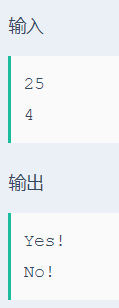

# 守形数

## 题目描述
>守形数是这样一种整数，它的平方的低位部分等于它本身。 比如25的平方是625，低位部分是25，因此25是一个守形数。 编一个程序，判断N是否为守形数。

## 输入描述:
>输入包括1个整数N，2<=N<100。

## 输出描述:
>可能有多组测试数据，对于每组数据，
>输出"Yes!”表示N是守形数。
>输出"No!”表示N不是守形数。

## 示例：
>
